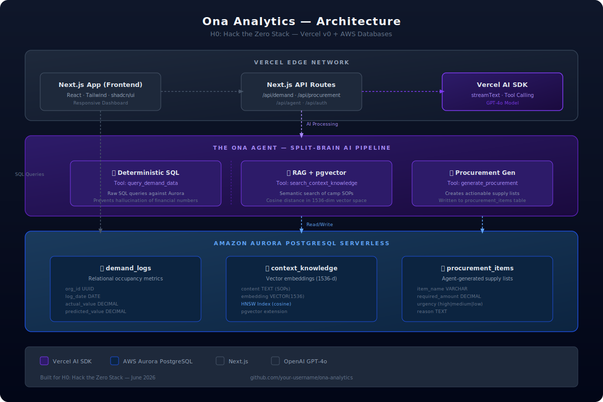

<div align="center">


 **Ona** (*verb, Swahili*): To See, Perceive, or Understand.

Ona Analytics is a serverless, AI-native demand radar built specifically for remote safari camps and eco-lodges to predict occupancy surges and secure isolated supply chains.

Built for the [H0: Hack the Zero Stack (Vercel + AWS)](https://h01.devpost.com/) Hackathon.


</div>

---

## 📐 Architecture



---

## 🎯 The High-Stakes Problem

Managers of remote luxury camps (10-25 tented suites in places like the Maasai Mara or Tsavo) operate in complete supply chain isolation. If a sudden 30% spike in weekend bookings occurs, they cannot simply run to a local supermarket. Supplies must be trucked in days in advance. Under-forecasting means running out of fresh food and linens 5 hours away from the nearest town. I built Ona Analytics to predict these surges so managers can optimize their weekly supply trucks before it's too late.

## 🧠 The Architecture & Database Justification

**I utilized Amazon Aurora PostgreSQL because my split-brain AI architecture required seamless, zero-latency querying of strict relational occupancy metrics alongside unstructured, high-dimensional vector embeddings (`pgvector`) for the camp's logistical SOPs, all within a single serverless environment.**

### The Split-Brain AI Pipeline

| Component | What It Does | Technology |
|---|---|---|
| **Deterministic SQL** | Executes raw SQL against `demand_logs` to get exact occupancy numbers | Aurora PostgreSQL + Vercel AI SDK Tool Calling |
| **RAG + pgvector** | Searches camp SOPs using semantic similarity for logistics knowledge | pgvector HNSW index (cosine distance) |
| **Procurement Gen** | Creates actionable supply truck lists from agent decisions | Written to `procurement_items` table |

## ✨ Core Mechanics

* 📈 **Predictive Demand Radar:** Visualizes historical occupancy rates alongside forward-looking predictive models.
* 🤖 **The Ona Agent:** An autonomous operations analyst built with the Vercel AI SDK using tool calling.
* 🗺️ **Dynamic Supply Mapping:** Translates forecasted demand into actionable supply truck procurement lists.
* 🔐 **Authentication:** Secure login with NextAuth.js credentials provider.
* 🌓 **Dark Mode:** Full dark/light theme support via next-themes.

## 🚀 Prerequisites

- Node.js 18+ 
- A **NVIDIA API key** for the Ona Agent (get one at https://build.nvidia.com/)
- An **Amazon Aurora PostgreSQL** database with pgvector enabled
- A **Resend API key** for password reset emails (optional for local dev)

## 🚀 Local Deployment

```bash
git clone https://github.com/your-username/ona-analytics.git
cd ona-analytics
npm install
cp .env.example .env
```

Then edit `.env` with your credentials:

| Variable | Description |
|---|---|
| `DATABASE_URL` | Your Aurora PostgreSQL connection string |
| `NVIDIA_API_KEY` | NVIDIA API key for the Ona Agent (Nemotron) |
| `AUTH_SECRET` | Run `openssl rand -base64 32` to generate |
| `AUTH_URL` | `http://localhost:3000` for local dev |

### Database Setup (via deployment — no local psql needed)

This project uses **Vercel OIDC + IAM authentication** — no static password. The database is auto-migrated when you deploy.

1. Deploy to Vercel (see below)
2. After deploy, make a `POST` request to `https://your-app.vercel.app/api/migrate` to run the schema + seed
3. Or visit the app — it will work once Aurora is provisioned

### Start Development Server

Pull env vars from Vercel first:

```bash
npx vercel env pull
npm run dev
```

> **Note:** Local dev requires `vercel env pull` to get the OIDC credentials needed for IAM auth. Alternatively, deploy to Vercel directly.

### Demo Credentials

| Role | Email | Password | Notes |
|------|-------|----------|-------|
| **Camp Manager** | `manager@ona-analytics.com` | `ona-demo-2026` | Ready to use — jump straight to the dashboard |
| **Admin** | `admin@ona-analytics.com` | `admin123` | Required to change password on first login |

## ☁️ Deploy to Vercel

1. Push this repo to GitHub
2. Import into Vercel
3. Vercel auto-detects the env vars from Storage → Aurora integration
4. Deploy
5. Run `curl -X POST https://your-app.vercel.app/api/migrate` to initialize the database

## 📹 Submission Checklist (for H0: Hack the Zero Stack)

- [x] Deployed Vercel project link — https://ona-analytics.vercel.app
- [x] Architecture diagram — `public/architecture-submission.svg`
- [x] Architecture diagram (README version) — `public/architecture.svg`
- [ ] AWS Console screenshot showing Aurora PostgreSQL resource
- [ ] Demo video (<3 min) with script at `docs/VIDEO-SCRIPT.md`
- [x] Devpost submission text at `docs/DEVPOST-SUBMISSION.md`
- [ ] Blog post on dev.to/medium using #H0Hackathon (bonus +0.6 points)

### Key Deliverables Location

| Item | File |
|------|------|
| Demo video script | `docs/VIDEO-SCRIPT.md` |
| Devpost submission text | `docs/DEVPOST-SUBMISSION.md` |
| Architecture diagram (submission) | `public/architecture-submission.svg` |
| Embedding generator script | `scripts/generate-real-embeddings.mjs` |
| ML forecasting API | `app/api/forecast/predict/route.ts` |
| Data ingestion API | `app/api/demand/ingest/route.ts` |
| Email integration | `lib/email.ts` |
